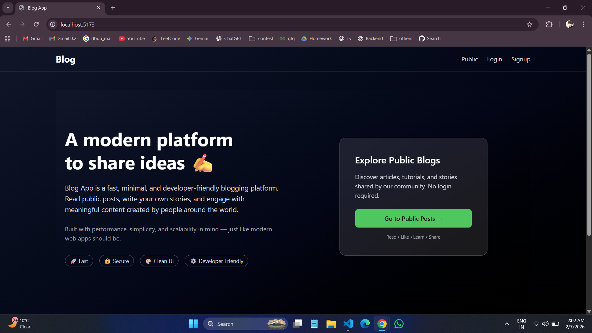
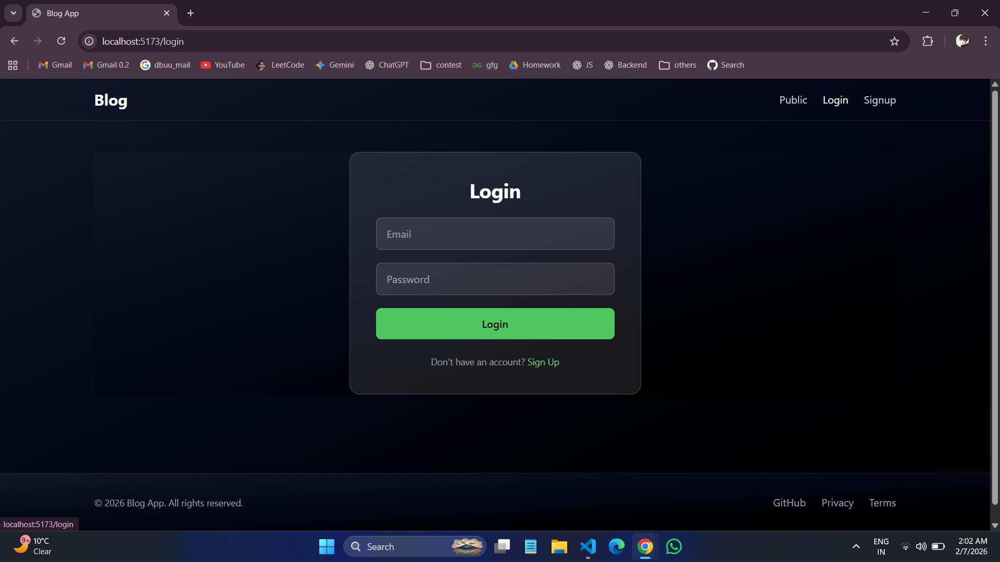
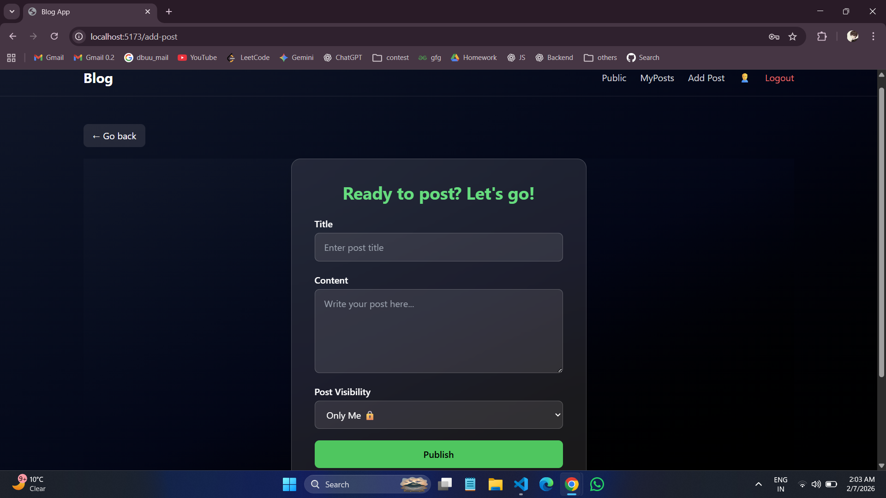
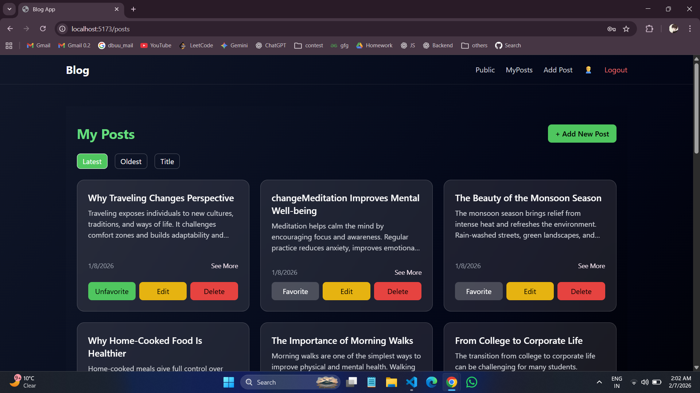

```md
# 📝 Blog App

A full-stack Blog Application where users can create, read, like, and manage blog posts with authentication and a clean, modern UI.

---

## 🚀 Features

- 🔐 User Authentication (Register / Login)
- ✍️ Create, Update & Delete Blogs
- ❤️ Like & Favorite Posts
- 🌍 Public & Private Blogs
- 👤 Author Information
- 📅 Created & Updated Dates
- 🌙 Dark Theme UI
- 📱 Responsive Design

---

## 🛠 Tech Stack

## 📸 Screenshots

<p align="center">
  
</p>

<p align="center">
  
  
  
</p>

### Frontend

- React.js
- Tailwind CSS
- Axios
- React Router

### Backend

- Node.js
- Express.js
- MongoDB
- Mongoose

### Auth & Security

- JWT Authentication
- Bcrypt Password Hashing

---

## 📂 Project Structure
```

blog-app/
├── client/
│ ├── src/
│ │ ├── components/
│ │ ├── pages/
│ │ └── services/
│ └── package.json
│
├── server/
│ ├── controllers/
│ ├── models/
│ ├── routes/
│ ├── middleware/
│ └── server.js
│
└── README.md

````

---

## 🔑 Environment Variables

Create a `.env` file inside the `server` folder:

```env
PORT=5000
MONGO_URI=your_mongodb_url
JWT_SECRET=your_jwt_secret
````

---

## ▶️ Run Locally

### Clone Repository

```bash
git clone https://github.com/your-username/blog-app.git
cd blog-app
```

### Start Backend

```bash
cd server
npm install
npm run dev
```

### Start Frontend

```bash
cd client
npm install
npm run dev
```

---

## 📸 Screenshots

(Add screenshots here)

---

## 📌 Future Enhancements

- Comment System
- Search & Filter Blogs
- Admin Dashboard
- Blog Analytics
- Deployment (Docker / Cloud)

---

## 📄 License

MIT License

---

## 👨‍💻 Author

**Kritmaan Rao**
B.Tech CSE | Full-Stack Developer

```

If you want:
- **GitHub-optimized README**
- **Portfolio-ready version**
- **Resume-friendly project description**
- **API documentation**

Just say it — I’ve got you 👌
```
